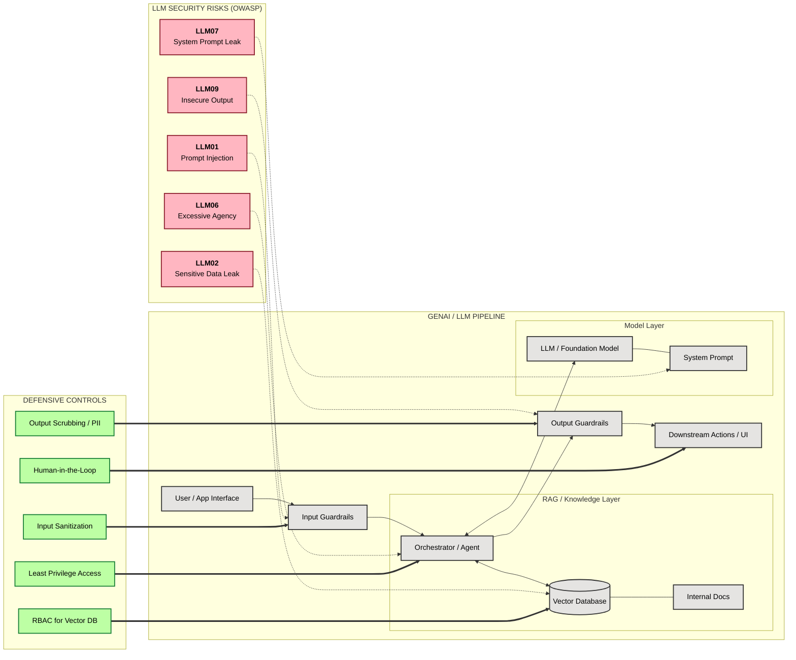

## Generative AI Security Architecture (Research View)

```mermaid
graph LR

%% ===== 1. CORE PIPELINE (Light Grey) =====
subgraph Pipeline ["GENAI / LLM PIPELINE"]
    direction LR
    USER[User / App Interface] --> IN_G[Input Guardrails]
    IN_G --> ORCH[Orchestrator / Agent]
    
    subgraph RAG_Layer ["RAG / Knowledge Layer"]
        ORCH <--> VDB[(Vector Database)]
        VDB --- DOCS[Internal Docs]
    end
    
    subgraph Inference_Layer ["Model Layer"]
        ORCH <--> LLM[LLM / Foundation Model]
        LLM --- SYS[System Prompt]
    end
    
    ORCH --> OUT_G[Output Guardrails]
    OUT_G --> ACTION[Downstream Actions / UI]
end

%% ===== 2. THREATS & ATTACK VECTORS (Light Pink) =====
subgraph Threats ["LLM SECURITY RISKS (OWASP)"]
    direction TB
    T1[<b>LLM01</b><br/>Prompt Injection]
    T2[<b>LLM06</b><br/>Excessive Agency]
    T3[<b>LLM09</b><br/>Insecure Output]
    T4[<b>LLM02</b><br/>Sensitive Data Leak]
    T5[<b>LLM07</b><br/>System Prompt Leak]
end

%% ===== 3. SECURITY CONTROLS (Light Green) =====
subgraph Controls ["DEFENSIVE CONTROLS"]
    direction TB
    C1[Input Sanitization]
    C2[Least Privilege Access]
    C3[Output Scrubbing / PII]
    C4[RBAC for Vector DB]
    C5[Human-in-the-Loop]
end

%% ===== MAPPING THREATS TO PIPELINE =====
T1 -.-> IN_G
T5 -.-> SYS
T2 -.-> ORCH
T4 -.-> VDB
T3 -.-> OUT_G

%% ===== MAPPING CONTROLS TO PIPELINE =====
C1 ===> IN_G
C2 ===> ORCH
C4 ===> VDB
C3 ===> OUT_G
C5 ===> ACTION

%% ===== ACCESSIBLE STYLING =====
classDef pipeline fill:#E5E4E2,color:#000,stroke:#333,stroke-width:2px;
classDef risk fill:#FFB6C1,color:#000,stroke:#8b1e2d,stroke-width:2px;
classDef control fill:#BDFFA4,color:#000,stroke:#1a7f37,stroke-width:2px;

class USER,IN_G,ORCH,VDB,DOCS,LLM,SYS,OUT_G,ACTION pipeline;
class T1,T2,T3,T4,T5 risk;
class C1,C2,C3,C4,C5 control;

```
