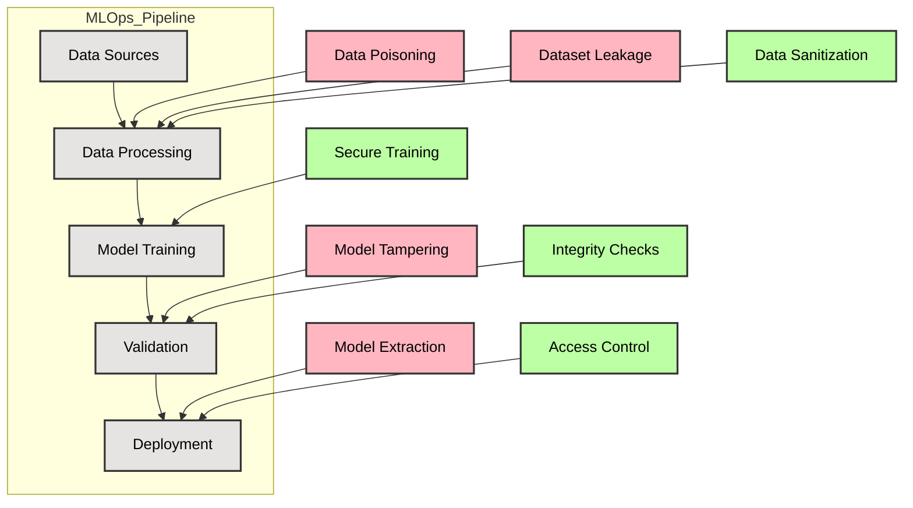

## MLOps Security Lifecycle (Research View)

This diagram models security risks and controls across a traditional machine learning lifecycle, emphasizing training integrity and deployment protection.

